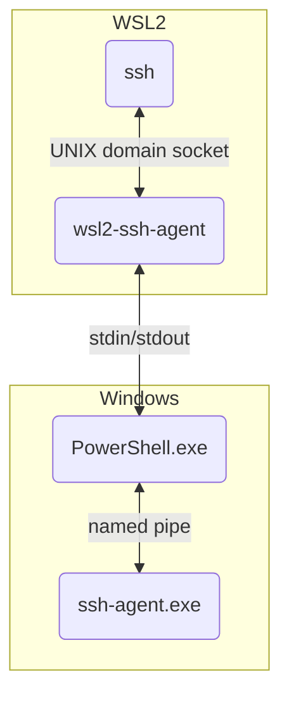

# wsl2-ssh-agent

This tool allows from WSL2 to use the ssh-agent service on Windows host.

## How to use

### 1. Install wsl2-ssh-agent

Put `wsl2-ssh-agent` binary in your favorite directory in WSL2, for example, `$HOME/`.

```
curl -L -O https://github.com/mame/wsl2-ssh-agent/releases/latest/download/wsl2-ssh-agent
```
If you are under ARM64 architecture, download the `arm64` binary instead:
```
curl -L -O https://github.com/mame/wsl2-ssh-agent/releases/latest/download/wsl2-ssh-agent-arm64
```
Change permisions so the binary is executable:
```
chmod 755 wsl2-ssh-agent
```

**If you are using ArchLinux, you can install the [wsl2-ssh-agent](https://aur.archlinux.org/packages/wsl2-ssh-agent) package from the AUR (maintained by @Hill-98).**

### 2. Modify your shell's rc file

#### bash or zsh

Add the following line to `.bashrc` (or `.zshrc` if you are using `zsh`).

```
eval $($HOME/wsl2-ssh-agent)
```

#### fish

Add the following lines to `config.fish`

```
if status is-login
  $HOME/wsl2-ssh-agent | source
end
```

### 3. Reopen your terminal

Close and reopen the terminal and execute `ssh your-machine`.
The command should communicate with ssh-agent.exe service.

## Tip: For pageant.exe

If you want to use with the named pipe provided by pageant.exe, you can use the `-pipename` option.
You can configure wsl2-ssh-agent as follows:

```
eval $($HOME/wsl2-ssh-agent -pipename $(grep -oP "IdentityAgent \"//\./pipe/\K[^\"]+" /mnt/c/.../pageant.conf))
```

(The author does not use pageant.exe. Let me know if it does not work.)

## Troubleshooting

### Make sure that ssh-agent.exe is working properly

* Open the "Services" app and check that "OpenSSH Authentication Agent" service is installed and running.
* Check that `ssh your-machine` works perfect on cmd.exe or PowerShell, not on WSL2.

### Check the log of ssh

* You may want to run `ssh -v your-machine` and read the log. If everything is good, you should see the following log.

```
debug1: get_agent_identities: bound agent to hostkey
debug1: get_agent_identities: agent returned XXX keys
```

### Check the log of wsl2-ssh-agent

* Run `wsl2-ssh-agent` in verbose and foreground mode and read the log. This is an example output.

```
# Stop the existing server if any
$ $HOME/wsl2-ssh-agent -stop

# Run in foreground mode
$ $HOME/wsl2-ssh-agent --verbose --foreground
[L] 2023/02/10 20:30:00 check the version of ssh.exe
[L] 2023/02/10 20:30:01 the version of ssh.exe: "OpenSSH_for_Windows_8.6p1, LibreSSL 3.4.3"
[L] 2023/02/10 20:30:01 ssh-agent.exe seems to be old; ignore OpenSSH extension messages
[L] 2023/02/10 20:30:01 start listening on /home/mame/.ssh/wsl2-ssh-agent.sock
[L] 2023/02/10 20:30:01 invoking [W] in PowerShell.exe
[W] 2023/02/10 21:51:09 ready: PSVersion 5.1.22621.963
[L] 2023/02/10 20:30:02 [W] invoked successfully
[L] 2023/02/10 20:30:05 ssh: connected
[L] 2023/02/10 20:30:05 ssh -> [L] (XXX B)
[L] 2023/02/10 20:30:05 ssh <- [L] (5 B) <dummy for OpenSSH ext.>
[L] 2023/02/10 20:30:05 ssh -> [L] (5 B)
[L] 2023/02/10 20:30:05 [L] -> [W] (5 B)
[W] 2023/02/10 21:51:12 [L] -> [W] -> ssh-agent.exe (5 B)
[W] 2023/02/10 21:51:12 [L] <- [W] <- ssh-agent.exe (XXX B)
[L] 2023/02/10 20:30:05 [L] <- [W] (XXX B)
[L] 2023/02/10 20:30:05 ssh <- [L] (XXX B)
[L] 2023/02/10 20:30:05 ssh -> [L] (XXX B)
[L] 2023/02/10 20:30:05 [L] -> [W] (XXX B)
[W] 2023/02/10 21:51:12 [L] -> [W] -> ssh-agent.exe (XXX B)
[W] 2023/02/10 21:51:12 [L] <- [W] <- ssh-agent.exe (XXX B)
[L] 2023/02/10 20:30:05 [L] <- [W] (XXX B)
[L] 2023/02/10 20:30:05 ssh <- [L] (XXX B)
[L] 2023/02/10 20:30:05 ssh: closed
```

## How wsl2-ssh-agent works

Linux ssh client connects to ssh-agent via a UNIX domain socket, while ssh-agent.exe service on Windows is listening on a named pipe. This command connects those two in the following mechanism.



* wsl2-ssh-agent listens on a UNIX domain socket (by default, $HOME/.ssh/wsl2-ssh-agent.sock).
* wsl2-ssh-agent invokes PowerShell.exe as a child process, which can communicate with ssh-agent.exe service via a named pipe.
* wsl2-ssh-agent and PowerShell.exe communicates via stdin/stdout thanks to WSL2 interop.

## Note

Usually, ssh and ssh-agent should be the same version. However, OpenSSH on Ubuntu 22.04 is 8.9, while Windows bundles OpenSSH 8.6 (on my machine, as of this writing).

[OpenSSH has extended the ssh-agent protocol since 8.9](https://github.com/openssh/openssh-portable/blob/master/PROTOCOL.agent). However, ssh-agent.exe does not understand the extended message and will not communicate properly. ([Japanese article](https://zenn.dev/qnighy/articles/8b992970b86653))

To address this issue, wsl2-ssh-agent does not pass the extended message to ssh-agent.exe. Instead, it swallows the message and reply a dummy SSH_AGENT_SUCCESS message to ssh client. Note that this may reduce the security strength. Please use this tool at your own risk.
