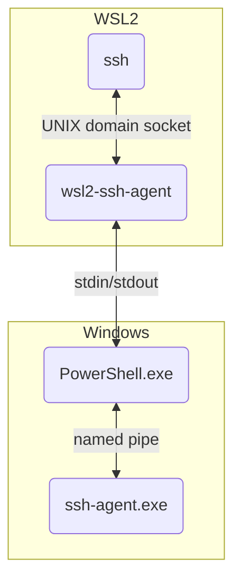

# wsl2-ssh-agent

This tool allows from WSL2 to use the ssh-agent service on Windows host.

## How to use

### 1. Install wsl2-ssh-agent

Put `wsl2-ssh-agent` binary in your favorite directory in WSL2, for example, `$HOME/`.

```
# For x86-64 architecture
curl -L -O https://github.com/mame/wsl2-ssh-agent/releases/latest/download/wsl2-ssh-agent

# For ARM64 architecture
curl -L -O https://github.com/mame/wsl2-ssh-agent/releases/latest/download/wsl2-ssh-agent-arm64
```

Then, make the binary executable:

```
chmod 755 wsl2-ssh-agent
```

Note for Arch Linux users: You can install the [wsl2-ssh-agent](https://aur.archlinux.org/packages/wsl2-ssh-agent) package from the AUR (maintained by @Hill-98).

### 2. Modify your shell's rc file

#### bash or zsh

Add the following line to `.bashrc` (or `.zshrc` if you are using `zsh`).

```
eval $($HOME/wsl2-ssh-agent)
```

#### fish

Add the following lines to `config.fish`

```
if status is-login
  $HOME/wsl2-ssh-agent | source
end
```

### 3. Systemd service (optional)

We also provide a [systemd service](extras/systemd/user/wsl2-ssh-agent.service). You can use it to automatically start `wsl2-ssh-agent` when you log in to WSL2. But if you are already using your shell's rc file to start `wsl2-ssh-agent`, you can safely skip this step.

* Copy the provided [`wsl2-ssh-agent.service`](extras/systemd/user/wsl2-ssh-agent.service)  file to `~/.config/systemd/user/`.
Make the directory if necessary.

* Enable and start the service:

  ```sh
  systemctl --user enable --now wsl2-ssh-agent.service
  ```

  **Note:** By default the service searches for `wsl2-ssh-agent` executable in `/usr/bin`;
  If you have it placed in a different location, you just need to modify the `ExecStart` line in the service file accordingly.

* Add the following to your shell's rc file (e.g., `.bashrc`, `.zshrc`):

  ```sh
  export SSH_AUTH_SOCK=$XDG_RUNTIME_DIR/wsl2-ssh-agent.sock
  ```

### 4. Reopen your terminal

Close and reopen the terminal.
You should now be able to run `ssh your-server` and connect using the keys managed by the Windows ssh-agent.exe service.

## Tip: Using with pageant.exe

If you want to use the named pipe provided by pageant.exe, you can use the `-pipename` option.
For example:

```
eval $($HOME/wsl2-ssh-agent -pipename $(grep -oP "IdentityAgent \"//\./pipe/\K[^\"]+" /mnt/c/.../pageant.conf))
```

(Note: The author does not use pageant.exe. If this doesn't work, please open an issue.)

## Troubleshooting

### Confirm ssh-agent.exe is working

* Open the "Services" app on Windows and confirm the "OpenSSH Authentication Agent" service is installed and running.
* Check that `ssh your-server` works perfectly from cmd.exe or PowerShell (i.e., outside of WSL2).

### Check the ssh client log

* You may want to run `ssh -v your-server` and read the log. If everything is working correctly, you should see lines similar to these.

```
debug1: get_agent_identities: bound agent to hostkey
debug1: get_agent_identities: agent returned XXX keys
```

### Check the wsl2-ssh-agent log

To see detailed logs, stop the agent and restart it in verbose foreground mode.

```
# Stop the existing server if any
$ $HOME/wsl2-ssh-agent -stop

# Run in foreground mode
$ $HOME/wsl2-ssh-agent --verbose --foreground
[L] 2025/07/29 19:51:27 start listening on /path/to/wsl2-ssh-agent.sock
[L] 2025/07/29 19:51:27 invoking [W] in PowerShell.exe
[W] 2025/07/29 19:51:28 ssh-agent.exe version: 9.5.4.1 (ignoreOpenSSHExtensions: False)
[L] 2025/07/29 19:51:28 [W] invoked successfully
[W] 2025/07/29 19:51:28 ready: PSVersion 5.1.22621.5624
[W] 2025/07/29 19:51:28 [W] named pipe: openssh-ssh-agent
[L] 2025/07/29 19:51:33 ssh: connected
[L] 2025/07/29 19:51:33 ssh -> [L] (XXX B)
[L] 2025/07/29 19:51:33 [L] -> [W] (XXX B)
[W] 2025/07/29 19:51:33 [W] named pipe: connected
[W] 2025/07/29 19:51:33 [L] -> [W] -> ssh-agent.exe (XXX B)
[L] 2025/07/29 19:51:33 [L] <- [W] (XXX B)
[W] 2025/07/29 19:51:33 [L] <- [W] <- ssh-agent.exe (XXX B)
[L] 2025/07/29 19:51:33 ssh <- [L] (XXX B)
[L] 2025/07/29 19:51:33 ssh -> [L] (XXX B)
[L] 2025/07/29 19:51:33 [L] -> [W] (XXX B)
[W] 2025/07/29 19:51:33 [W] named pipe: disconnected
[W] 2025/07/29 19:51:33 [W] named pipe: connected
[W] 2025/07/29 19:51:33 [L] -> [W] -> ssh-agent.exe (XXX B)
[L] 2025/07/29 19:51:33 [L] <- [W] (XXX B)
[L] 2025/07/29 19:51:33 ssh <- [L] (XXX B)
[W] 2025/07/29 19:51:33 [L] <- [W] <- ssh-agent.exe (XXX B)
[W] 2025/07/29 19:51:33 [W] named pipe: disconnected
[L] 2025/07/29 19:51:33 ssh -> [L] (XXX B)
[L] 2025/07/29 19:51:33 [L] -> [W] (XXX B)
[W] 2025/07/29 19:51:33 [W] named pipe: connected
[W] 2025/07/29 19:51:33 [L] -> [W] -> ssh-agent.exe (XXX B)
[L] 2025/07/29 19:51:33 [L] <- [W] (XXX B)
[L] 2025/07/29 19:51:33 ssh <- [L] (XXX B)
[W] 2025/07/29 19:51:33 [L] <- [W] <- ssh-agent.exe (XXX B)
[W] 2025/07/29 19:51:33 [W] named pipe: disconnected
[L] 2025/07/29 19:51:33 ssh: closed
[L] 2025/07/29 19:51:33 ssh: connected
[L] 2025/07/29 19:51:33 ssh: closed
```

## How It Works

The SSH client in Linux communicates with an agent via a UNIX domain socket, while the ssh-agent.exe service on Windows listens on a named pipe. This tool connects the two using the following mechanism:



* wsl2-ssh-agent starts a server that listens on a UNIX domain socket in WSL2 (by default, $HOME/.ssh/wsl2-ssh-agent.sock).
* It then invokes a PowerShell.exe child process on the Windows host.
* The wsl2-ssh-agent process in WSL2 and the PowerShell process in Windows communicate via their stdin/stdout streams, which are connected by the WSL interop layer. The PowerShell process then forwards communication to the Windows ssh-agent.exe service via its named pipe.

## Note on Windows OpenSSH Compatibility

My motivation for creating wsl2-ssh-agent was to work around a compatibility issue in OpenSSH. [The newer SSH client (version 8.9+) sends an extended protocol message](https://github.com/openssh/openssh-portable/blob/master/PROTOCOL.agent) that the older Windows agent (before 8.9) doesn't understand, which can cause the connection to fail. ([Japanese article](https://zenn.dev/qnighy/articles/8b992970b86653))

To fix this, wsl2-ssh-agent checks your Windows OpenSSH version. When it detects an older version (before 8.9), it intercepts these unsupported messages and sends a valid, compatible response back to the client. This prevents the old agent from failing and allows the connection to work.

Modern Windows now includes an updated OpenSSH (9.5 or newer), so this problem no longer exists on up-to-date systems. The fix is automatically applied only when necessary, so you can use this tool on any system without changing your settings.